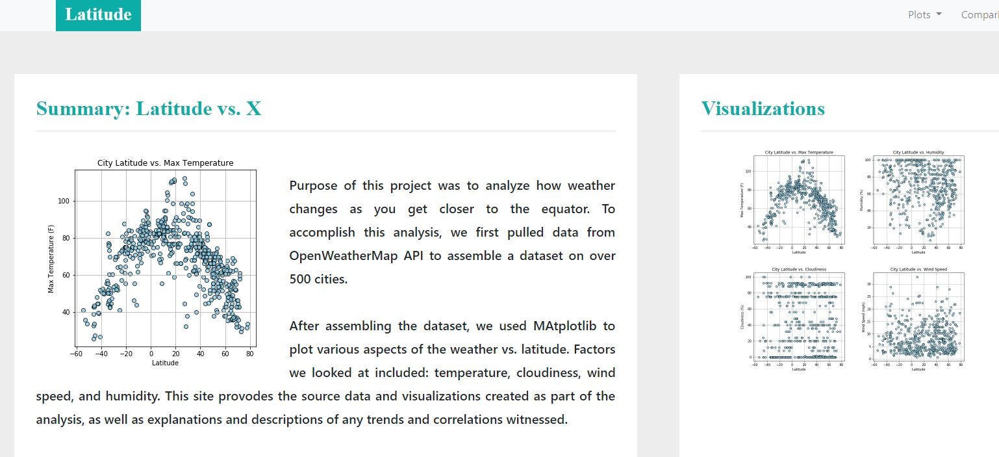

# Presenting weather_correlations results
Here I built a simple web presentation of Weather Correlation data. I used HTML, Bootstrap and some CSS styling. Some advanced features been used,  such as: custom NavBar from Bootstrap, dynamic style changing as size of the page changes, mobile-compatible layout. 

Deployed site available here: https://olegmrnv.github.io/weather_correlations/ or download repo and open index.html

Initial work on obtaining data, cleaning and analyzing has been performed in following project: https://github.com/olegmrnv/Weather-correlations

